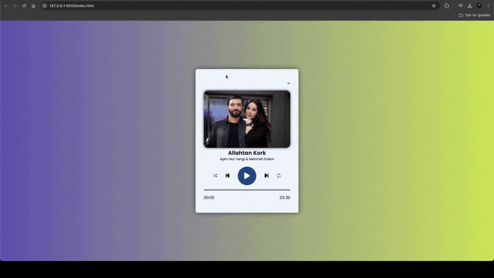

# Technologies Used

- HTML: I used HTML to structure and organize the content of the project.
- CSS: CSS was applied to style the project and create a visually appealing layout.
- JavaScript: JavaScript was implemented to add dynamic functionality to the project.
- Web Audio API: I leveraged the Web Audio API to enable audio playback, pausing, and control features.
- SVG: SVG (Scalable Vector Graphics) was utilized to include scalable and flexible visual elements.

Git and GitHub: Git and GitHub were used for version control and managing collaboration during the development process.

### GIF

